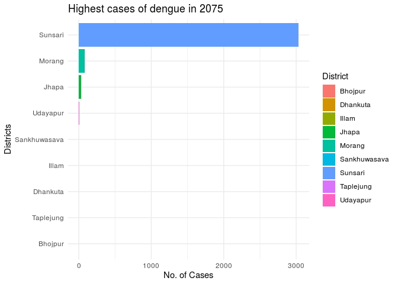

 
 

## Annual Dengue report cases in Nepal

Nepal has been suffering from wide spread Dengue. We have presented a visualization of Dengue cases annual report from 2070 - 2076.

## Highest dengue cases in year 2070

<!-- -->

### Highest cases of dengue in 2070

<!-- -->

## Highest cases of dengue in 2070 by Province

<!-- -->

###  Province 1

<!-- -->

### Province 2

<!-- -->

### Province 3

<!-- -->

### Province 4

<!-- -->

### Province 5

<!-- -->

### Province 6

<!-- -->

### Province 7

<!-- -->
